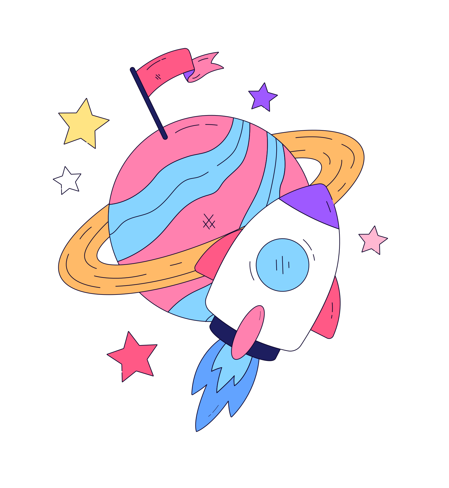

<!--<h2 align="left"> Hey! I'm Hassaleah </h2>

I'm a Graphic Designer from sunny El Salvador, i have a creative soul, trying to bring ideas to life and coordinate projects from start to finish. Besides design, I've also dipped into programming, especially loving Front-End development✨

###

 

  
  

  

    <h5 align="left">Technologies and programms I've been working with recently:</h6>
  
  
  
  
  
  
  
  
  
  
  
  
  

###

 

  

###-->

# Hey! I'm Hassaleah

  
  
I'm a Graphic Designer from sunny El Salvador, i have a creative soul, trying to bring ideas to life and coordinate projects from start to finish.
     Besides design, I've also dipped into programming, especially loving Front-End development✨

  

<h4>👨‍💻 You can see some of my projects at https://hassalea.github.io/portfolio/  </h4>
<h4>✉️ Contact me on: www.linkedin.com/in/hassaleah</h4>

## Languages and Tools  
 

    
    
    
    
    
    

